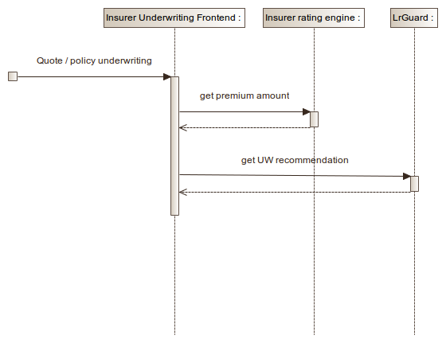
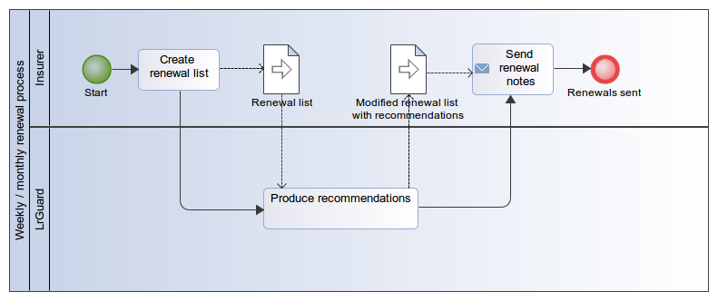

## LR Guard
Introduction

---

LR Guard is an addition on the top of the insurer's rating capabilities
with the intention to further decrease loss ratios and improve renewal
success.

---

The insurer uploads 1-3 previous years of policy data with claims amounts.

The engine learns it.

At underwriting time or at renewals the engine gives recommendations:

- decline / renewal not invited
- additional loading / discounts within a specified range (typically -10 to +25%)

---

The engine can learn more details than traditional rating models, as

- interactions between multiple factors, e.g. young drivers in certain car types
- usage of factors that are too granular for traditional models, e.g exact car model as a factor
- usage of factors that are not in the rating model and not easy to include, e.g. zip codes

---

The engine is capable to react to fraud.

E.g. if certain districts do have car theft, or fraudulent workshops,
the engine will notice and start loading / excluding.

---
### Integration - Underwriting

---
### Integration - Renewals

---

Results of renewals may be fed back to the engine so it may take success
predictions into consideration for next rounds. e.g. by giving slight
discounts for  low risk client profiles who did not renew well at previous rounds.

---